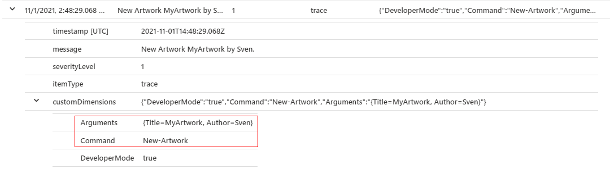

# AppInsights - Application Insights for PowerShell


AppInsights is a PowerShell module that makes Application Insights available for PowerShell and extends it with supporting functions for PowerShell.
The module simplifies the interaction with Application Insights and offers some convenient functions for automatic log tracking.

- [AppInsights - PowerShell Gallery](https://www.powershellgallery.com/packages/AppInsights/)

## Features
- Easy to start with ([Quickstart](#quickstart))
- Natively supports PowerShell hashtables for properties and metrics.
- Flexibility in the use of the Instrumentation Key. 
  - Enables the Instrumentation Key to be stored as an Environment Variable.
- Automatic capture of the extended host and command context and its parameters ([Extended PowerShell Context](#extended-powershell-context)).
- The module has extensive and automatic tests.

## Quickstart 

### Install and import AppInsights
```PowerShell
# Installs and imports the latest version.
Install-Module AppInsights

Import-Module AppInsights
```

### Authentication with Environment Variable
This can be implemented, for example, with a system variable to simplify the authentication of tasks and services.
```PowerShell
# Authenticate with enviroment variable "AI_INSTRUMENTATION_KEY"
$env:AI_INSTRUMENTATION_KEY = "decf0103-ed91-4880-b01d-31fe4fa12c98"

# Send trace
Send-AppInsightsTrace -Message "Message" -Properties @{ CustomProperty = "CustomProperty1" }
```

### Authentication with Parameter
Send traces with Instrumentation Key as parameter. This will overwrite the Environment Vriable if set.
```PowerShell
Send-AppInsightsTrace -Message "Message" -InstrumentationKey "decf0103-ed91-4880-b01d-31fe4fa12c98" 
```

##  Docs
Overview and documentation of currently supported commands.
- [Command Documentation](./docs/)
- [Send-AppInsightsTrace](./docs/Send-AppInsightsTrace.md)
- [Send-AppInsightsDependency](./docs/Send-AppInsightsDependency.md)
- [Send-AppInsightsEvent](./docs/Send-AppInsightsEvent.md)
- [Send-AppInsightsException](./docs/Send-AppInsightsException.md)
- [Send-AppInsightsAvailability](./docs/Send-AppInsightsAvailability.md)
- [Send-AppInsightsRequest](./docs/Send-AppInsightsRequest.md)
- 
## Notes
- The module works for PowerShell 5 and PowerShell 7.
- The module is based on Microsoft.ApplicationInsights (2.18.0). This version is tagged as deprecated but 
    with PowerShell 7, there is still a dependency conflict with the current versio (2.20) at the moment. Therefore, the outdated package is currently still used.

## Extended PowerShell Context
The context of a command is automatically captured. This means:
- Host name, culture and version of the PowerShell runtime are collected.
- The invoking command and its parameters, arguments and the script line number are captured.
- Custom properties are also structured and identified by a property prefix.
- Metrics are structured and identified by a metric prefix.
- **To disable it use the -DisableContext switch**.

### Samples
Here are a few samples for querying the extended context in Application Insights with KUSTO Query Language:
```kusto
// this filters powershell 5.1 hosts
traces 
| sort by timestamp desc 
| extend hostContext = todynamic(tostring(customDimensions.hostContext))
| where  hostContext.version startswith "5.1"

// this filters for the invoking script
traces 
| sort by timestamp desc 
| extend commandContext = todynamic(tostring(customDimensions.commandContext))
| where  commandContext.name == "Invoke-CommandSamples.ps1"

// this filters for custom properties
traces 
| sort by timestamp desc 
| extend customProperties = todynamic(tostring(customDimensions.customProperties))
| where  not(isempty(customProperties))

```

This is how it looks in Application Insights:

